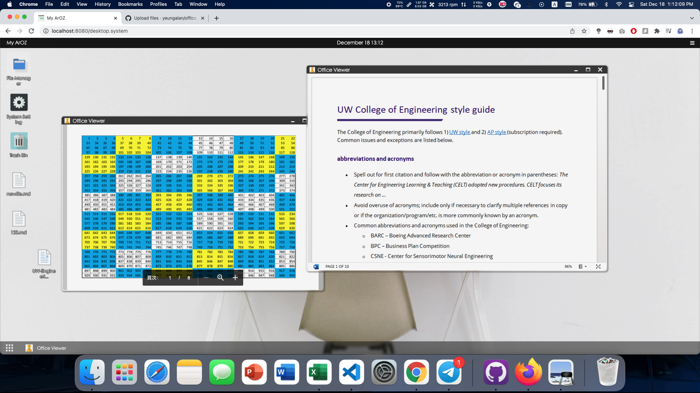

# Office Viewer

A basic document viewer for ArozOS

**THIS IS NOT A WEBAPP. DO NOT INSTALL VIA MODULE INSTALLER**

## Installation

### Requirement

- Go 1.14 or above

### Build Instruction

git clone this repo in the subservice folder and run build.sh. The  following examples assume your arozos root folder is located at `~/arozos`

```
cd `~/arozos/subservice/
git clone https://github.com/yeungalan/office_viewer/
cd office_viewer
./build.sh
```

## Configuration

No config required

### Screenshot



## License

MIT License
